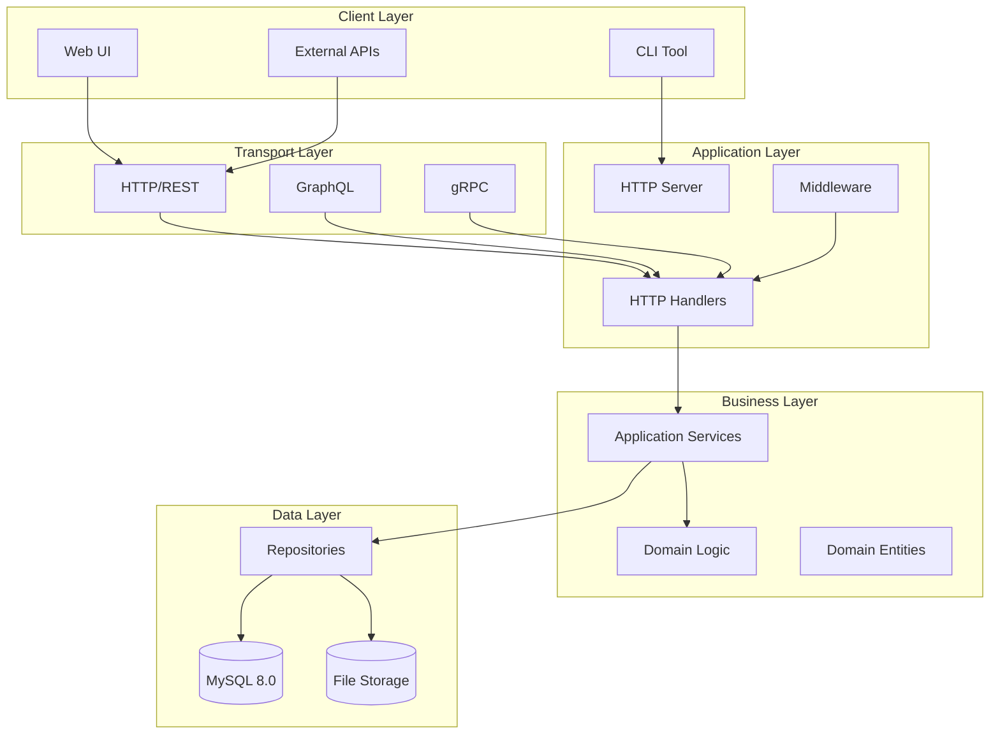
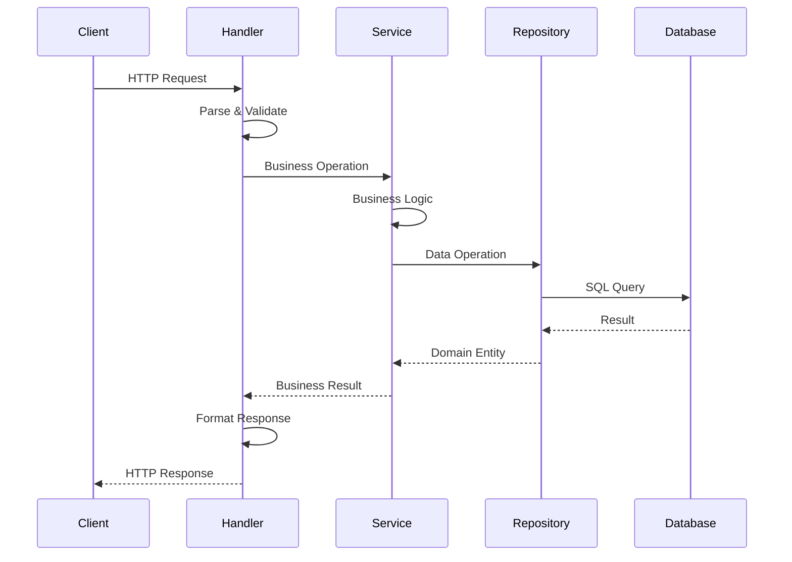
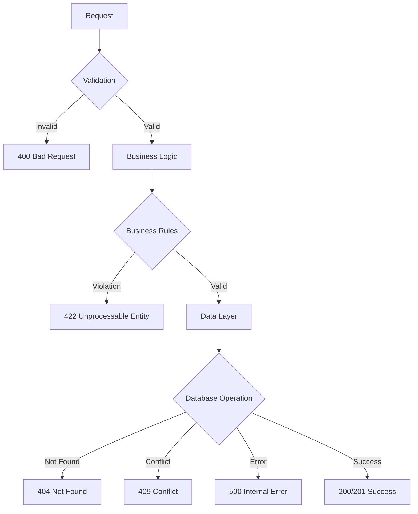

# Architecture Overview

SARC-NG follows Clean Architecture principles with a clear separation of concerns and dependency inversion.

## High-Level Architecture



## Project Structure

```
sarc-ng/
├── cmd/                    # Application entrypoints
│   ├── cli/               # Command-line interface
│   ├── lambda/            # AWS Lambda function
│   └── server/            # HTTP API server
│
├── internal/              # Internal application code
│   ├── adapter/           # External service adapters
│   │   ├── db/           # Database interfaces
│   │   └── gorm/         # GORM implementations
│   │
│   ├── domain/            # Business domain logic
│   │   ├── building/     # Building entity & logic
│   │   ├── class/        # Class entity & logic
│   │   ├── lesson/       # Lesson entity & logic
│   │   ├── reservation/  # Reservation entity & logic
│   │   ├── resource/     # Resource entity & logic
│   │   └── common/       # Shared domain logic
│   │
│   ├── service/           # Application services
│   │   ├── building/     # Building service
│   │   ├── class/        # Class service
│   │   ├── lesson/       # Lesson service
│   │   ├── reservation/  # Reservation service
│   │   └── resource/     # Resource service
│   │
│   └── transport/         # Transport layer
│       ├── rest/         # REST API handlers
│       └── common/       # Shared transport logic
│
├── pkg/                   # Public packages
│   ├── metrics/          # Metrics collection
│   └── rest/             # REST client utilities
│
├── api/                   # API specifications
│   └── swagger/          # Generated Swagger documentation
├── configs/               # Configuration files
├── infrastructure/        # Infrastructure as Code
│   ├── docker/           # Docker Compose configurations
│   ├── sam/              # AWS SAM (Serverless) deployment
│   └── terraform/        # Terraform/Terragrunt IaC
└── test/                 # Integration tests
```

## Core Components

### 1. Domain Layer (`internal/domain/`)

The domain layer contains the business logic and entities:

```go
// Domain Entity
type Building struct {
    ID        int       `json:"id"`
    Name      string    `json:"name"`
    Code      string    `json:"code"`
    Address   string    `json:"address,omitempty"`
    Floors    int       `json:"floors,omitempty"`
    CreatedAt time.Time `json:"createdAt"`
    UpdatedAt time.Time `json:"updatedAt"`
}

// Domain Repository Interface
type BuildingRepository interface {
    Create(ctx context.Context, building *Building) error
    GetByID(ctx context.Context, id int) (*Building, error)
    GetAll(ctx context.Context) ([]*Building, error)
    Update(ctx context.Context, building *Building) error
    Delete(ctx context.Context, id int) error
}

// Domain Service
type BuildingService struct {
    repo BuildingRepository
}
```

### 2. Service Layer (`internal/service/`)

Application services orchestrate business operations:

```go
type BuildingService struct {
    buildingRepo domain.BuildingRepository
    logger       *slog.Logger
}

func (s *BuildingService) CreateBuilding(ctx context.Context, req CreateBuildingRequest) (*Building, error) {
    // Validation logic
    if err := s.validateBuilding(req); err != nil {
        return nil, err
    }

    // Business logic
    building := &Building{
        Name:    req.Name,
        Code:    strings.ToUpper(req.Code),
        Address: req.Address,
        Floors:  req.Floors,
    }

    // Persist
    if err := s.buildingRepo.Create(ctx, building); err != nil {
        return nil, err
    }

    return building, nil
}
```

### 3. Transport Layer (`internal/transport/`)

HTTP handlers handle request/response concerns:

```go
type BuildingHandler struct {
    buildingService service.BuildingService
}

func (h *BuildingHandler) CreateBuilding(w http.ResponseWriter, r *http.Request) {
    var req CreateBuildingRequest
    if err := json.NewDecoder(r.Body).Decode(&req); err != nil {
        http.Error(w, "Invalid request", http.StatusBadRequest)
        return
    }

    building, err := h.buildingService.CreateBuilding(r.Context(), req)
    if err != nil {
        http.Error(w, err.Error(), http.StatusInternalServerError)
        return
    }

    w.Header().Set("Content-Type", "application/json")
    w.WriteStatus(http.StatusCreated)
    json.NewEncoder(w).Encode(building)
}
```

### 4. Data Layer (`internal/adapter/`)

Repository implementations handle data persistence:

```go
type GormBuildingRepository struct {
    db *gorm.DB
}

func (r *GormBuildingRepository) Create(ctx context.Context, building *Building) error {
    return r.db.WithContext(ctx).Create(building).Error
}

func (r *GormBuildingRepository) GetByID(ctx context.Context, id int) (*Building, error) {
    var building Building
    err := r.db.WithContext(ctx).First(&building, id).Error
    if err != nil {
        return nil, err
    }
    return &building, nil
}
```

## Design Patterns

### 1. Repository Pattern

- Abstracts data access logic
- Enables easy testing with mocks
- Supports multiple data sources

### 2. Dependency Injection

- Uses constructor injection
- Managed by dependency injection container
- Enables loose coupling

### 3. Clean Architecture

- Business logic independent of frameworks
- Testable architecture
- Database and UI agnostic core

### 4. Domain-Driven Design (DDD)

- Organized around business domains
- Rich domain models
- Ubiquitous language

## Data Flow

### Request Flow



### Error Handling Flow



## Database Design

### Core Entities (MySQL 8.0)

The application uses GORM for ORM with automatic migrations. Tables are created automatically on startup.

```sql
-- Buildings
CREATE TABLE buildings (
    id BIGINT UNSIGNED AUTO_INCREMENT PRIMARY KEY,
    name LONGTEXT,
    code LONGTEXT,
    created_at DATETIME(3) NULL,
    updated_at DATETIME(3) NULL,
    deleted_at DATETIME(3) NULL
);

-- Classes
CREATE TABLE classes (
    id BIGINT UNSIGNED AUTO_INCREMENT PRIMARY KEY,
    name LONGTEXT,
    capacity BIGINT,
    created_at DATETIME(3) NULL,
    updated_at DATETIME(3) NULL,
    deleted_at DATETIME(3) NULL
);

-- Resources
CREATE TABLE resources (
    id BIGINT UNSIGNED AUTO_INCREMENT PRIMARY KEY,
    name LONGTEXT,
    type LONGTEXT,
    description LONGTEXT,
    is_available BOOLEAN,
    location LONGTEXT,
    created_at DATETIME(3) NULL,
    updated_at DATETIME(3) NULL,
    deleted_at DATETIME(3) NULL
);

-- Lessons
CREATE TABLE lessons (
    id BIGINT UNSIGNED AUTO_INCREMENT PRIMARY KEY,
    title LONGTEXT,
    duration BIGINT,
    description LONGTEXT,
    start_time DATETIME(3) NULL,
    end_time DATETIME(3) NULL,
    created_at DATETIME(3) NULL,
    updated_at DATETIME(3) NULL,
    deleted_at DATETIME(3) NULL
);

-- Reservations
CREATE TABLE reservations (
    id BIGINT UNSIGNED AUTO_INCREMENT PRIMARY KEY,
    resource_id BIGINT UNSIGNED,
    user_id BIGINT UNSIGNED,
    start_time DATETIME(3) NULL,
    end_time DATETIME(3) NULL,
    purpose LONGTEXT,
    status LONGTEXT,
    description LONGTEXT,
    created_at DATETIME(3) NULL,
    updated_at DATETIME(3) NULL,
    deleted_at DATETIME(3) NULL
);
```

**Note:** GORM handles migrations automatically. Soft deletes are implemented using `deleted_at` field.

## Configuration

### Environment-Based Configuration

```yaml
# configs/development.yaml
server:
  port: 8080
  timeout: 30s

database:
  host: localhost
  port: 3306
  name: sarcng
  user: root
  password: example

auth:
  jwt_secret: dev-secret-key
  token_ttl: 24h

logging:
  level: debug
  format: json
```

### Dependency Injection

The application uses [Wire](https://github.com/google/wire) for compile-time dependency injection:

```bash
# Generate dependency injection code
make wire

# Generates cmd/server/wire_gen.go and cmd/lambda/wire_gen.go
```

## Security

### Authentication & Authorization

- JWT-based authentication
- Role-based access control (RBAC)
- API key authentication for integrations
- Request rate limiting

### Data Protection

- Input validation and sanitization
- SQL injection prevention (parameterized queries)
- XSS protection
- CORS configuration

### Infrastructure Security

- HTTPS/TLS encryption
- Database connection encryption
- Secrets management
- Network security groups

## Monitoring & Observability

### Metrics

- Application metrics (Prometheus format)
- Database performance metrics
- HTTP request metrics
- Custom business metrics

### Logging

- Structured logging (JSON)
- Correlation IDs for request tracing
- Different log levels per environment
- Centralized log aggregation

### Health Checks

- Liveness probes
- Readiness probes
- Dependency health checks
- Graceful shutdown

This architecture provides a solid foundation for maintainable, scalable, and testable code while following Go best practices and industry standards.
