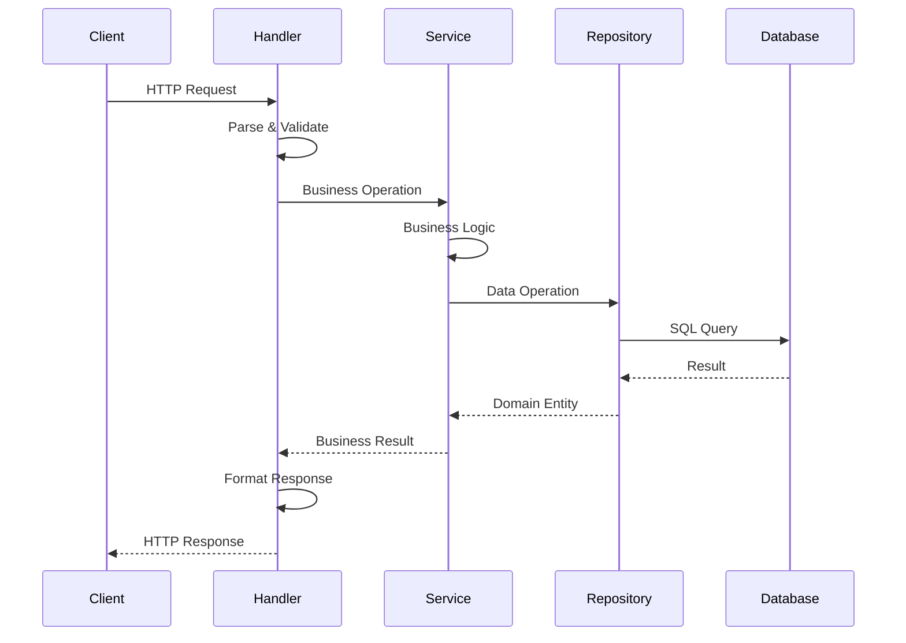
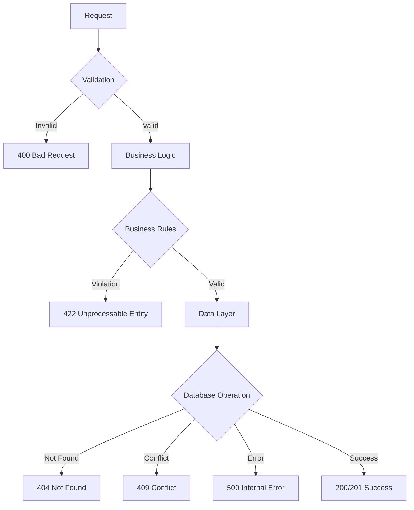

# Architecture

SARC-NG follows Clean Architecture principles with clear separation of concerns.

## Layers

```
Transport Layer (HTTP/REST)
    ↓
Service Layer (Business Logic)
    ↓
Domain Layer (Entities & Use Cases)
    ↓
Repository Layer (Data Access)
    ↓
Database (MySQL 8.0)
```

## Project Structure

```
sarc-ng/
├── cmd/                    # Application entry points
│   ├── cli/               # CLI tool
│   ├── lambda/            # AWS Lambda
│   └── server/            # HTTP server
├── internal/
│   ├── domain/            # Business entities & interfaces
│   │   ├── building/
│   │   ├── class/
│   │   ├── lesson/
│   │   ├── reservation/
│   │   └── resource/
│   ├── service/           # Application services
│   ├── adapter/           # External adapters (DB, etc)
│   └── transport/         # HTTP handlers
├── pkg/                   # Public packages
├── api/                   # OpenAPI specs
└── configs/               # Configuration files
```

## Core Components

### Domain Layer
Business entities and repository interfaces:

```go
type Building struct {
    ID        int
    Name      string
    Code      string
    CreatedAt time.Time
}

type BuildingRepository interface {
    Create(ctx context.Context, building *Building) error
    GetByID(ctx context.Context, id int) (*Building, error)
    GetAll(ctx context.Context) ([]*Building, error)
}
```

### Service Layer
Orchestrates business operations:

```go
type BuildingService struct {
    repo BuildingRepository
}

func (s *BuildingService) CreateBuilding(ctx context.Context, req Request) (*Building, error) {
    // Validation
    // Business logic
    // Persist
    return s.repo.Create(ctx, building)
}
```

### Transport Layer
HTTP handlers:

```go
type BuildingHandler struct {
    service BuildingService
}

func (h *BuildingHandler) CreateBuilding(w http.ResponseWriter, r *http.Request) {
    // Parse request
    // Call service
    // Return response
}
```

## Dependency Injection

Uses [Wire](https://github.com/google/wire) for compile-time DI:

```go
// cmd/server/wire.go
//go:build wireinject

func InitializeServer() (*Server, error) {
    wire.Build(
        config.Load,
        adapter.NewDB,
        gorm.NewBuildingRepository,
        service.NewBuildingService,
        rest.NewBuildingHandler,
        NewServer,
    )
    return nil, nil
}
```

Generate with: `make wire`

## API Design

RESTful endpoints following standard patterns:

```
GET    /api/v1/{entity}        # List all
POST   /api/v1/{entity}        # Create
GET    /api/v1/{entity}/:id    # Get by ID
PUT    /api/v1/{entity}/:id    # Update
DELETE /api/v1/{entity}/:id    # Delete
```

Entities: `buildings`, `classes`, `lessons`, `resources`, `reservations`

## Database

- **Engine**: MySQL 8.0
- **ORM**: GORM
- **Migrations**: Auto-migrate on startup
- **Connection Pooling**: Configurable via settings

## Error Handling

Standardized error responses:

```go
type ErrorResponse struct {
    Error   string `json:"error"`
    Message string `json:"message"`
    Code    int    `json:"code"`
}
```

## Configuration

Hierarchical config system:
1. Environment variables (highest priority)
2. Environment-specific YAML (`development.yaml`)
3. Base YAML (`default.yaml`)
4. Defaults in code

## Testing

- **Unit Tests**: Domain and service layers
- **Integration Tests**: Full API endpoints
- **Mocking**: Repository interfaces for testing

Run with: `make test`
    w.WriteStatus(http.StatusCreated)
    json.NewEncoder(w).Encode(building)
}
```

### 4. Data Layer (`internal/adapter/`)

Repository implementations handle data persistence:

```go
type GormBuildingRepository struct {
    db *gorm.DB
}

func (r *GormBuildingRepository) Create(ctx context.Context, building *Building) error {
    return r.db.WithContext(ctx).Create(building).Error
}

func (r *GormBuildingRepository) GetByID(ctx context.Context, id int) (*Building, error) {
    var building Building
    err := r.db.WithContext(ctx).First(&building, id).Error
    if err != nil {
        return nil, err
    }
    return &building, nil
}
```

## Design Patterns

### 1. Repository Pattern

- Abstracts data access logic
- Enables easy testing with mocks
- Supports multiple data sources

### 2. Dependency Injection

- Uses constructor injection
- Managed by dependency injection container
- Enables loose coupling

### 3. Clean Architecture

- Business logic independent of frameworks
- Testable architecture
- Database and UI agnostic core

### 4. Domain-Driven Design (DDD)

- Organized around business domains
- Rich domain models
- Ubiquitous language

## Data Flow

### Request Flow



### Error Handling Flow



## Database Design

### Core Entities (MySQL 8.0)

The application uses GORM for ORM with automatic migrations. Tables are created automatically on startup.

```sql
-- Buildings
CREATE TABLE buildings (
    id BIGINT UNSIGNED AUTO_INCREMENT PRIMARY KEY,
    name LONGTEXT,
    code LONGTEXT,
    created_at DATETIME(3) NULL,
    updated_at DATETIME(3) NULL,
    deleted_at DATETIME(3) NULL
);

-- Classes
CREATE TABLE classes (
    id BIGINT UNSIGNED AUTO_INCREMENT PRIMARY KEY,
    name LONGTEXT,
    capacity BIGINT,
    created_at DATETIME(3) NULL,
    updated_at DATETIME(3) NULL,
    deleted_at DATETIME(3) NULL
);

-- Resources
CREATE TABLE resources (
    id BIGINT UNSIGNED AUTO_INCREMENT PRIMARY KEY,
    name LONGTEXT,
    type LONGTEXT,
    description LONGTEXT,
    is_available BOOLEAN,
    location LONGTEXT,
    created_at DATETIME(3) NULL,
    updated_at DATETIME(3) NULL,
    deleted_at DATETIME(3) NULL
);

-- Lessons
CREATE TABLE lessons (
    id BIGINT UNSIGNED AUTO_INCREMENT PRIMARY KEY,
    title LONGTEXT,
    duration BIGINT,
    description LONGTEXT,
    start_time DATETIME(3) NULL,
    end_time DATETIME(3) NULL,
    created_at DATETIME(3) NULL,
    updated_at DATETIME(3) NULL,
    deleted_at DATETIME(3) NULL
);

-- Reservations
CREATE TABLE reservations (
    id BIGINT UNSIGNED AUTO_INCREMENT PRIMARY KEY,
    resource_id BIGINT UNSIGNED,
    user_id BIGINT UNSIGNED,
    start_time DATETIME(3) NULL,
    end_time DATETIME(3) NULL,
    purpose LONGTEXT,
    status LONGTEXT,
    description LONGTEXT,
    created_at DATETIME(3) NULL,
    updated_at DATETIME(3) NULL,
    deleted_at DATETIME(3) NULL
);
```

**Note:** GORM handles migrations automatically. Soft deletes are implemented using `deleted_at` field.

## Configuration

### Environment-Based Configuration

```yaml
# configs/development.yaml
server:
  port: 8080
  timeout: 30s

database:
  host: localhost
  port: 3306
  name: sarcng
  user: root
  password: example

auth:
  jwt_secret: dev-secret-key
  token_ttl: 24h

logging:
  level: debug
  format: json
```

### Dependency Injection

The application uses [Wire](https://github.com/google/wire) for compile-time dependency injection:

```bash
# Generate dependency injection code
make wire

# Generates cmd/server/wire_gen.go and cmd/lambda/wire_gen.go
```

## Security

### Authentication & Authorization

- JWT-based authentication
- Role-based access control (RBAC)
- API key authentication for integrations
- Request rate limiting

### Data Protection

- Input validation and sanitization
- SQL injection prevention (parameterized queries)
- XSS protection
- CORS configuration

### Infrastructure Security

- HTTPS/TLS encryption
- Database connection encryption
- Secrets management
- Network security groups

## Monitoring & Observability

### Metrics

- Application metrics (Prometheus format)
- Database performance metrics
- HTTP request metrics
- Custom business metrics

### Logging

- Structured logging (JSON)
- Correlation IDs for request tracing
- Different log levels per environment
- Centralized log aggregation

### Health Checks

- Liveness probes
- Readiness probes
- Dependency health checks
- Graceful shutdown

This architecture provides a solid foundation for maintainable, scalable, and testable code while following Go best practices and industry standards.
